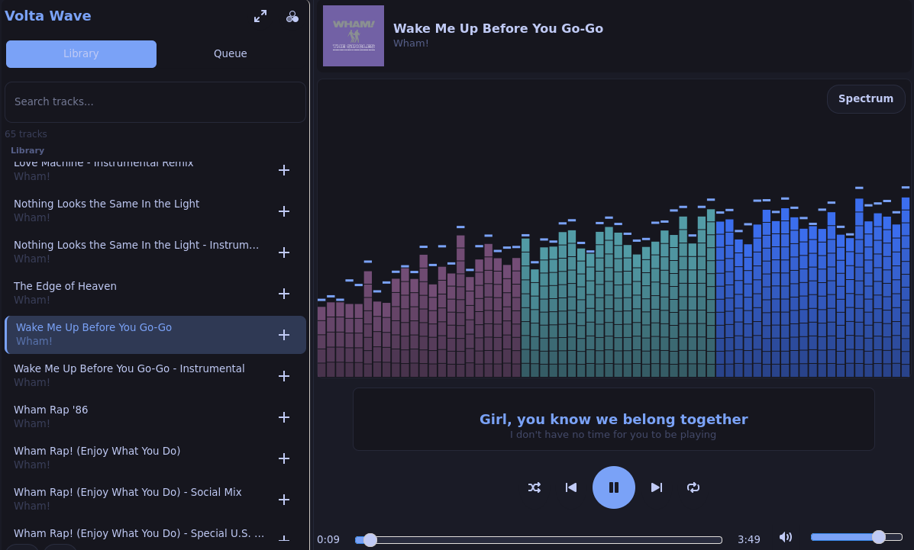
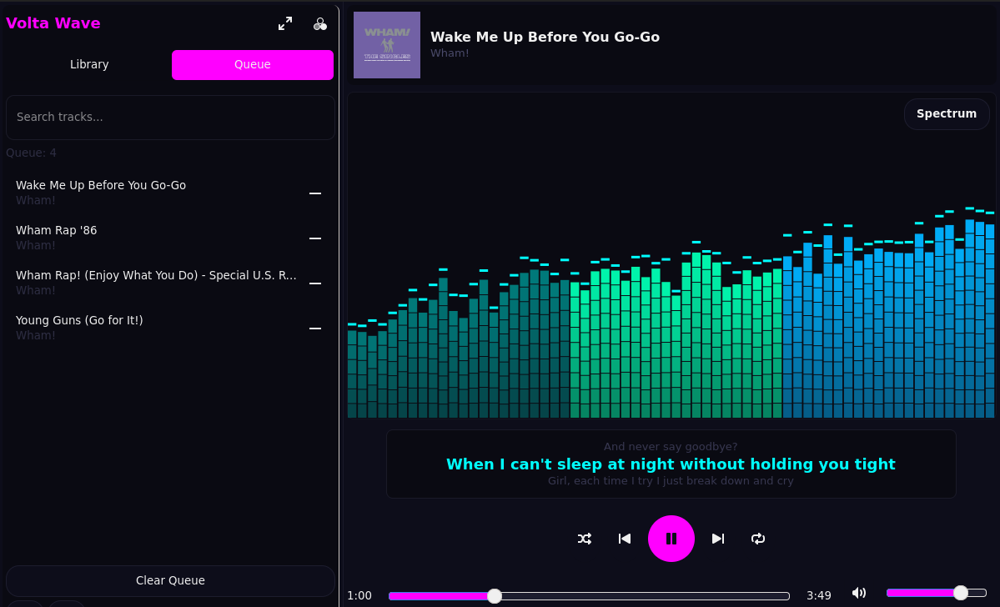
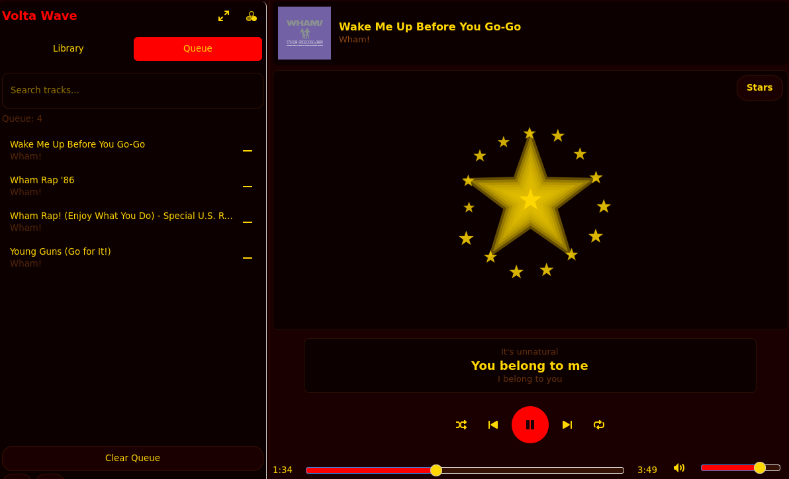
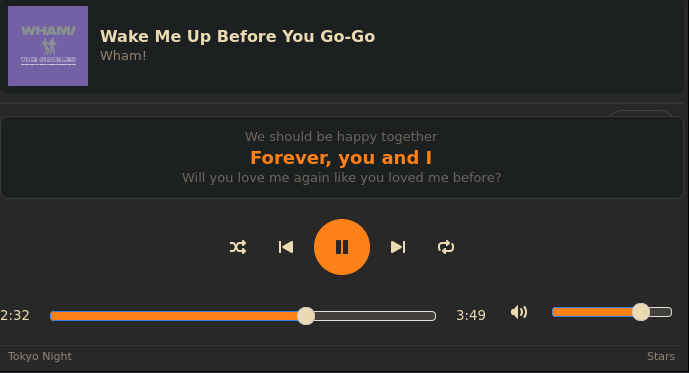

# Volta Wave GTK

A native GTK4 music player with audio visualizations, built with Rust. Part of the Volta Agent ecosystem.

## Screenshots


*Main player interface with visualization and library (light theme)*


*Playing a track with album art display (dark theme)*


*Queue view with track management*


*Compact mini view for distraction-free listening*

## Features

- **Audio Playback**: Play MP3, FLAC, OGG, WAV, M4A, AAC, and WebM files
- **Album Art**: Extracts and displays embedded album art from audio files
- **6 Visualization Modes**: Bars, Wave, Circles, Stars, Mirror, Spectrum
- **9 Color Themes**: Tokyo Night, Gruvbox, Dracula, Nord, Catppuccin, Solarized, Cyberpunk, Forest, Communist Red
- **Mini View Mode**: Compact 400x150 window for minimal distraction
- **Queue Management**: Add tracks to queue, view queue, play from queue
- **Shuffle & Repeat**: Randomize playback or repeat single/all tracks
- **Lyrics Support**: Automatic lyrics fetching from LRCLIB
- **Playlist Save/Load**: Save and load playlists to JSON files
- **Search**: Filter tracks by title or artist
- **Context Menus**: Right-click tracks for quick actions

## Keyboard Shortcuts

| Key | Action |
|-----|--------|
| Space | Play/Pause |
| Left Arrow | Seek -5 seconds |
| Right Arrow | Seek +5 seconds |
| A | Seek -10 seconds |
| D | Toggle Mini/Full view |
| V | Cycle visualization modes |
| T | Cycle color themes |
| Up Arrow | Volume Up |
| Down Arrow | Volume Down |
| M | Mute/Unmute |
| S | Toggle Shuffle |
| R | Cycle Repeat modes |
| Escape | Clear search |

## Themes

| Theme | Description |
|-------|-------------|
| Tokyo Night | Dark theme with purple accents |
| Gruvbox | Warm retro colors |
| Dracula | Purple-based dark theme |
| Nord | Cold blue-gray theme |
| Catppuccin | Soft pastel colors |
| Solarized | Precision color scheme |
| Cyberpunk | Neon pink and cyan |
| Forest | Natural green tones |
| Communist Red | Bold red and gold revolutionary aesthetic |

## Visualization Modes

- **Bars**: Classic frequency bar visualization
- **Wave**: Oscilloscope-style waveform
- **Circles**: Circular frequency representation
- **Stars**: Twinkling starfield effect
- **Mirror**: Mirrored waveform display
- **Spectrum**: Full spectrum analyzer

## Installation

### Prerequisites

- Rust 1.70+
- GTK4 development libraries
- GStreamer plugins

```bash
# Ubuntu/Debian
sudo apt install libgtk-4-dev libgstreamer1.0-dev libgstreamer-plugins-base1.0-dev gstreamer1.0-plugins-base gstreamer1.0-plugins-good gstreamer1.0-plugins-bad gstreamer1.0-libav

# Fedora
sudo dnf install gtk4-devel gstreamer1-devel gstreamer1-plugins-base-devel gstreamer1-plugins-good gstreamer1-plugins-bad-free gstreamer1-libav

# Arch
sudo pacman -S gtk4 gstreamer gst-plugins-base gst-plugins-good gst-plugins-bad gst-libav
```

### Build

```bash
git clone https://github.com/volta-agent/volta-wave-gtk.git
cd volta-wave-gtk
cargo build --release
```

### Install

```bash
sudo cp target/release/volta-wave-gtk /usr/local/bin/
cp volta-wave-gtk.desktop ~/.local/share/applications/
```

## Usage

```bash
# Run with default music directory (~/Music)
volta-wave-gtk

# Specify a custom music directory
volta-wave-gtk /path/to/music

# Scan favorites folder
volta-wave-gtk ~/Music/Favorites
```

## Project Structure

```
volta-wave-gtk/
├── src/
│   └── main.rs       # Main application code
├── Cargo.toml        # Dependencies
├── README.md         # This file
└── volta-wave-gtk.desktop  # Desktop entry
```

## License

MIT

## Support

BTC: 1NV2myQZNXU1ahPXTyZJnGF7GfdC4SZCN2

## Related Projects

- [volta-wave-gui](https://github.com/volta-agent/volta-wave-gui) - Web-based version
- [volta-zen](https://github.com/volta-agent/volta-zen) - Ambient soundscape generator
- [volta-radio](https://github.com/volta-agent/volta-radio) - Internet radio player
